## Hepatocellular Carcinoma

::::: columns
::: {.column width="35%"}
-   Liver cancer ranks as the [6th]{.alert} most common cancer and
    [3rd]{.alert} leading cause of cancer-related death worldwide

-   Hepatocellular carcinoma represents [75-85%]{.alert} of all liver
    cancer cases wordwide.

-   5-year survival rates in the U.S. have risen from 3% (1975-1977) to
    22% (2014-2020)
:::

::: {.column width="65%"}

:::
:::::

## Where Y90 Fits Diagnosis

::::: columns
::: {.column width="40%"}
Y90 is suited for liver-dominant disease, especially:

-   BCLC A tumors not amenable to ablation

-   BCLC B intermediate tumors

-   Select BCLC C patients with portal vein thrombosis
:::

::: {.column width="60%"}
{.lightbox}
:::
:::::

# Historical Evolution of Y90

## 1960s - 1990s

:::::: columns
::: {.column width="50%"}
-   In 1951, Bierman et al demonstrated angiographically that liver
    tumors received their blood supply from the hepatic artery and not
    the portal vein.

-   1967, Ariel & Pack perform first Y90 administration in four patients
:::

:::: {.column width="50%"}
::: {layout="[1, 1, 1]"}
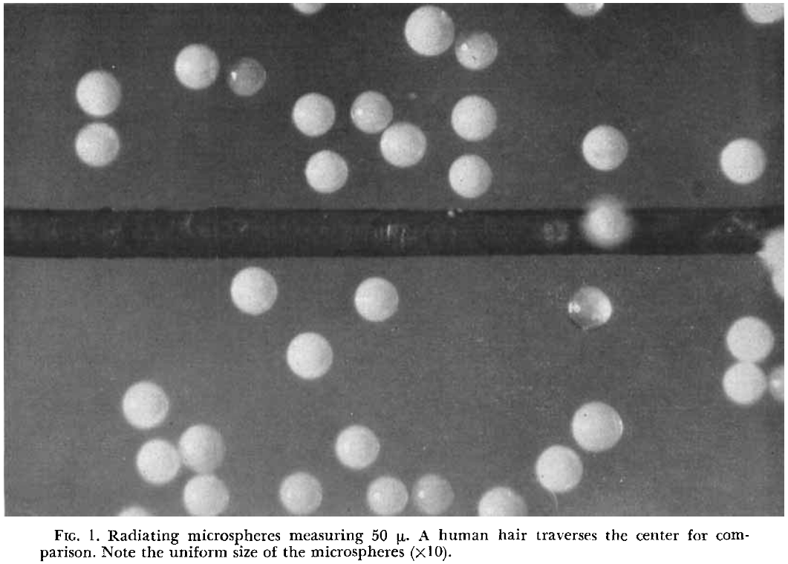{.lightbox height="200"}

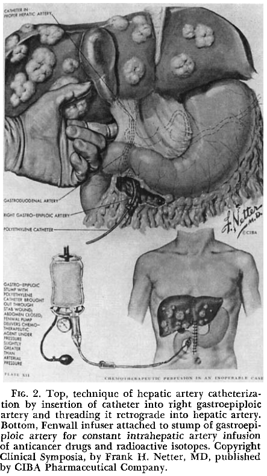{.lightbox height="200"}

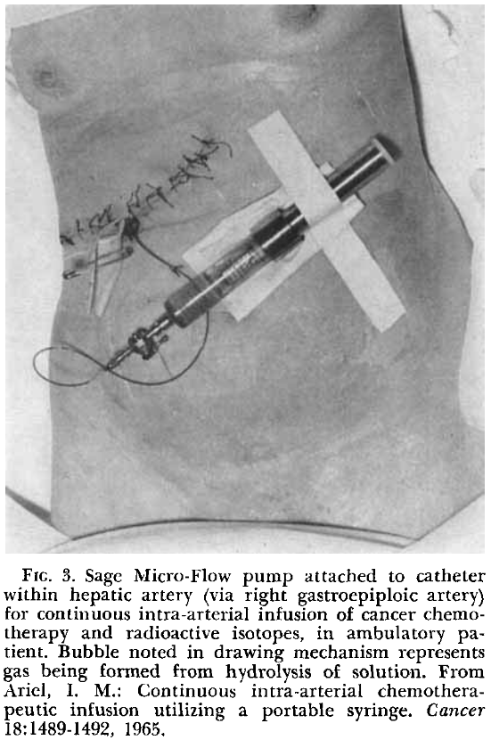{.lightbox height="200"}
:::
::::
::::::

## 2000s - Present

::::: columns
::: {.column width="40%"}
1999: TheraSphere granted a humanitarian device exemption for use in
patients with unresectable HCC.

2016: SIR-Spheres approved for the treatment of unresectable metastatic
liver tumors from primary colorectal cancer with adjuvant intrahepatic
artery chemotherapy.

2025: SIR-Spheres for the treatment of unresectable hepatocellular
carcinoma (HCC) following the [DOORwaY-90]{.alert} study
:::

::: {.column width="60%" layout="[1,1]"}
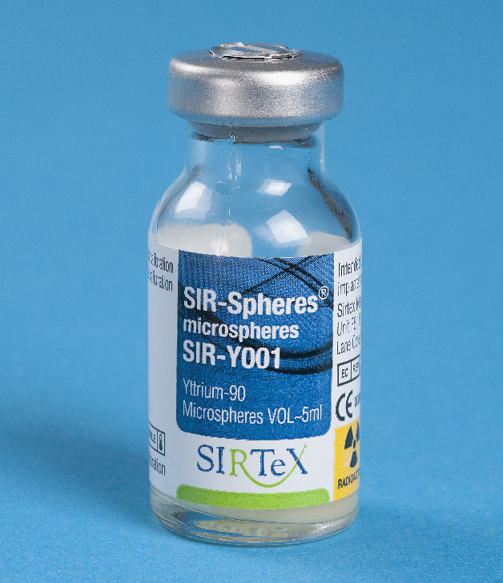{width="259"}

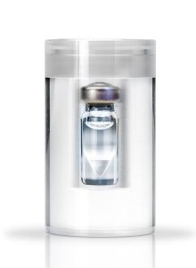{width="300"}
:::
:::::

# Establishing TARE in the HCC Algorithm

## SARAH Trial

:::::: columns
::: {.column width="40%"}
-   Phase III, open-label, randomized controlled trial

-   $^{90}$Y Resin Microspheres vs. Sorafenib for advanced HCC (BCLC C)

-   [No significant difference in overall survival]{.alert} (8.0 months
    for Y90 vs. 9.9 months for sorafenib)

-   Radioembolization associated with [fewer adverse events]{.alert} and
    better quality of life
:::

::: {.column width="30%"}
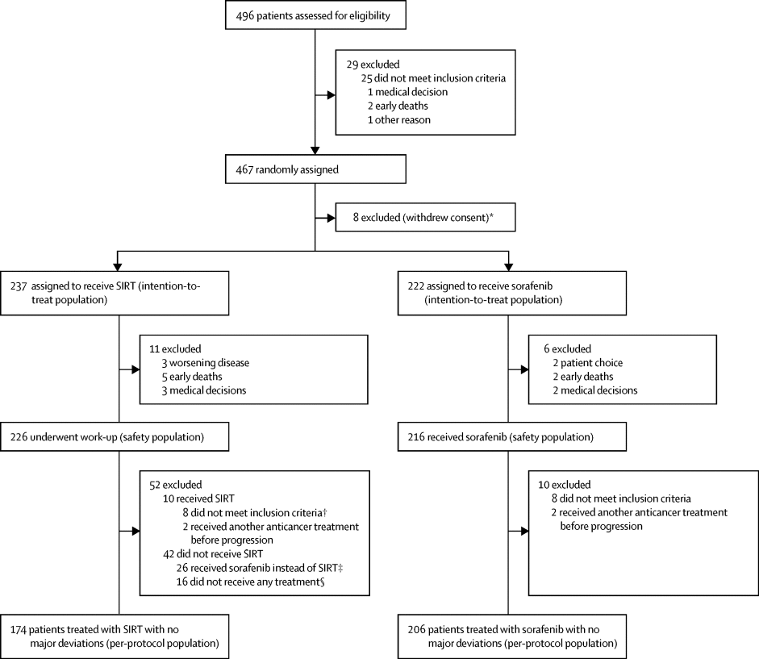{.lightbox}
:::

::: {.column width="30%"}
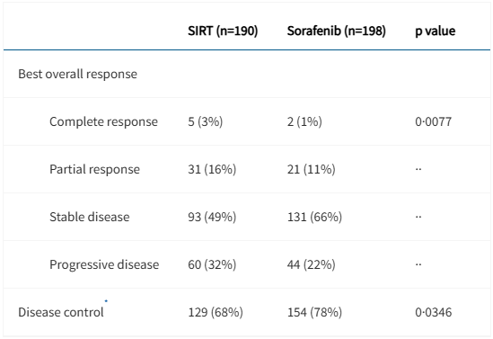{.lightbox}
:::
::::::

## SIRveNIB Trial

:::::: columns
::: {.column width="40%"}
-   Phase III, open-label, randomized controlled trial

-   $^{90}$Y Resin Microspheres vs. Sorafenib for advanced HCC (BCLC B
    or C) in the Asia-Pacific

-   [No significant difference in overall survival]{.alert} (8.8 months
    for Y90 vs. 10.0 months for sorafenib)

-   Radioembolization showed significantly [fewer grade 3 adverse fewer
    adverse events]{.alert} (27.7% vs. 50.6%)
:::

::: {.column width="30%"}
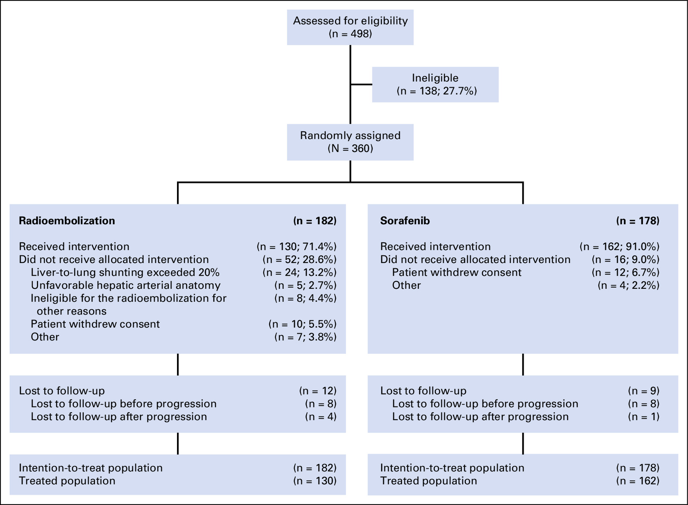{.lightbox}
:::

::: {.column width="30%"}
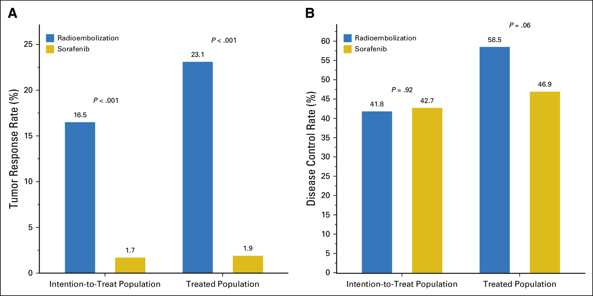{.lightbox}
:::
::::::

## DOSISPHERE-01 Trial

:::::: columns
::: {.column width="40%"}
-   Phase III, open-label, randomized controlled trial

-   Personalized Dosimetry (≥205 Gy target) vs. Standard Dosimetry (∼120
    Gy target)

-   Personalized dosimetry showed [higher median overall
    survival]{.alert} (26.6 months for vs. 10.7 months)

-   Also showed [higher tumor responses response rates]{.alert} (71% vs.
    36%) and [increased rates of downstaging]{.alert} to surgical
    treatments (35% vs. 3.5%)\
:::

::: {.column width="30%"}
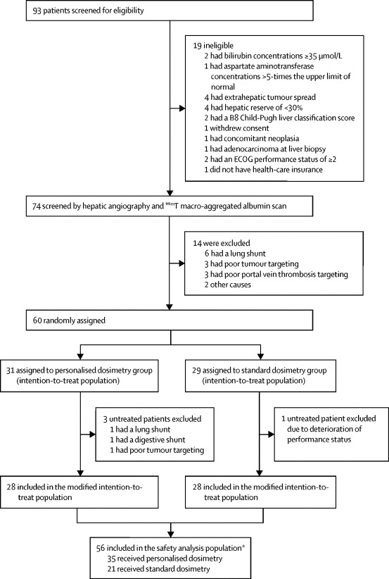{.lightbox}
:::

::: {.column width="30%"}
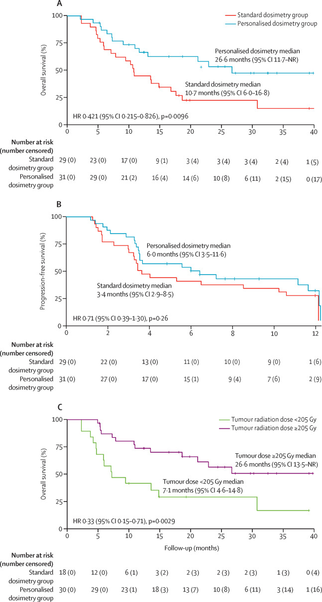{.lightbox}
:::
::::::

## TRACE Trial

:::::: columns
::: {.column width="40%"}
-   Y90 Radioembolization vs. Drug-Eluting Bead Chemoembolization
    (DEB-TACE)

-   The trial was stopped early because the primary endpoint (TTP) was
    met in favor of Y90

-   Y90 TARE showed [superior median overall]{.alert} (30.2 months vs.
    15.6 months)
:::

::: {.column width="30%"}
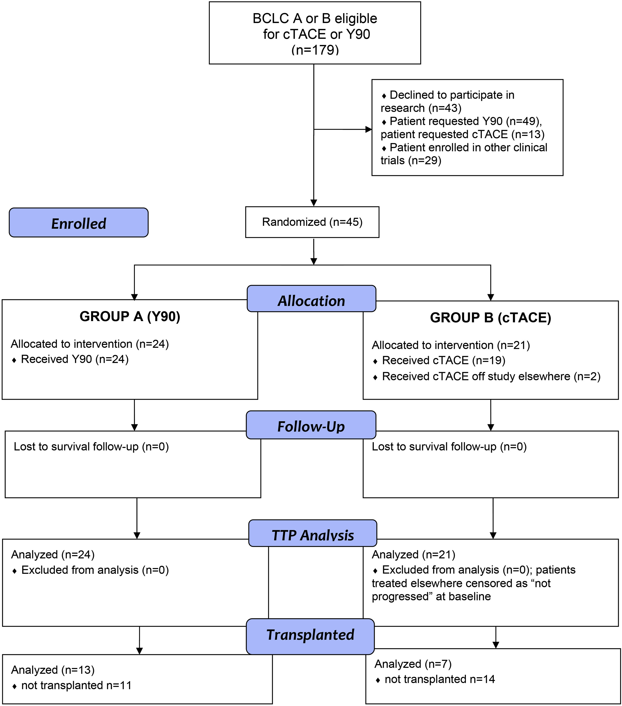{.lightbox}
:::

::: {.column width="30%"}
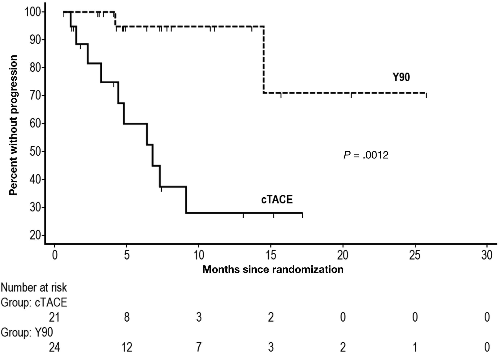{.lightbox}
:::
::::::

# Modern Y90 Concepts

## Radiation Segmentectomy

::::: columns
::: {.column width="60%"}
Superselective infusion of a very high dose (\> 400 Gy)

Evidence:

-   LEGACY trial: ORR 90%, median OS \~45 months

Pearls:

-   Identify variant anatomy (parasitizing supply, accessory/replaced
    vessels)
-   Different segments are associated with different post-embolization
    complications
:::

::: {.column width="40%"}
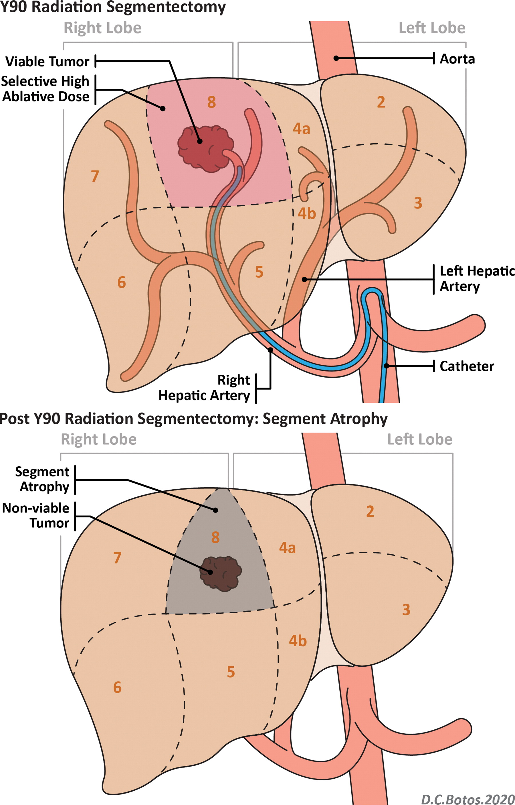{.lightbox .nostretch
width="256"}
:::
:::::

## Radiation Lobectomy

::::: columns
::: {.column width="60%"}
Lobar dose to induce hypertrophy of the contralateral lobe

Alternative to portal vein embolization

Provides tumor control while waiting for future liver remnant (FLR)
growth
:::

::: {.column width="40%"}
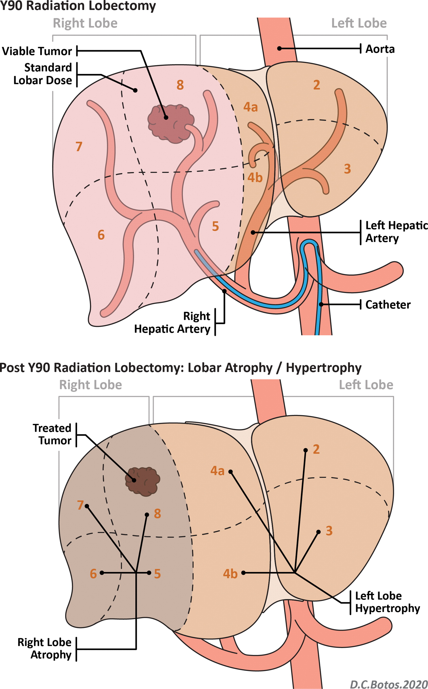{.lightbox width="249"}
:::
:::::

## Personalized Dosimetry

::::: columns
::: column
Old model: everyone gets the same dose

Modern model

-   99mTc-MAA SPECT/CT

-   Voxel- or partition-based dosimetry

-   Targeted dose delivery

Evidence

-   DOSISPHERE-01: OS 10.7 → 26.6 mo
:::

::: column
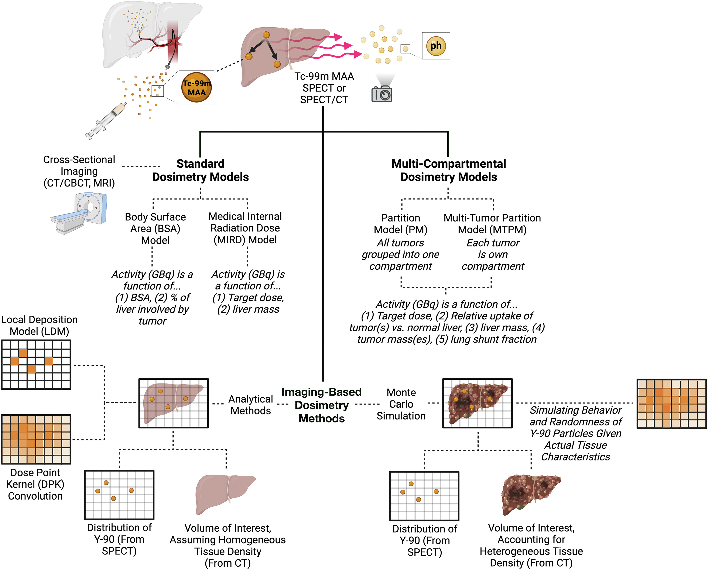{.lightbox width="496"}
:::
:::::

# Clinical Workflow {auto-animate="true"}

## Patient Selection: Screeening {auto-animate="true"}

::::: columns
::: {.column width="40%"}
-   Child-Pugh A and early B

-   Liver-dominant disease

-   Assess vascular anatomy and shunting

-   Multidisciplinary input with hepatology and surgery
:::

::: {.column width="40%"}
[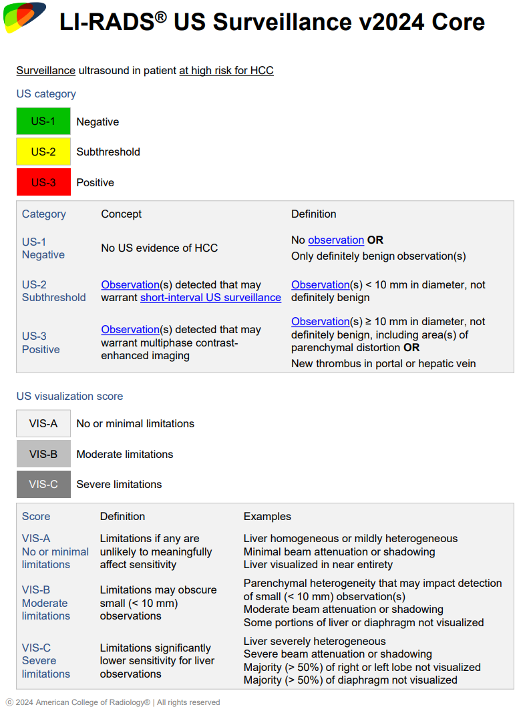](https://edge.sitecorecloud.io/americancoldf5f-acrorgf92a-productioncb02-3650/media/ACR/Files/RADS/LI-RADS/LI-RADS-US-Surveillance-v2024-Core.pdf)
:::
:::::

## Patient Selection: Screening {auto-animate="true"}

::::: columns
::: {.column width="30%"}

:::

::: {.column width="30%"}
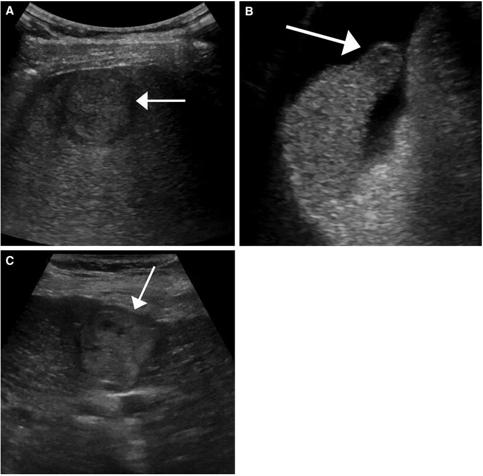{.lightbox height="500"}
:::
:::::

## Patient Selection: Diagnosis {auto-animate="true"}

:::: columns
::: {.column width="40%"}
[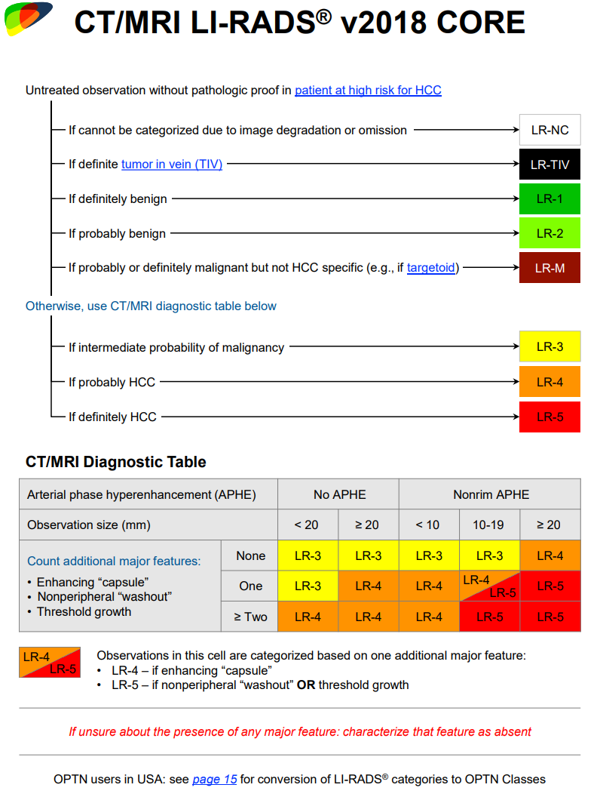{height="500"}](https://edge.sitecorecloud.io/americancoldf5f-acrorgf92a-productioncb02-3650/media/ACR/Files/RADS/LI-RADS/LI-RADS-CT-MRI-2018-Core.pdf)
:::
::::

## Patient Selection: Diagnosis {auto-animate="true"}

::::: columns
::: {.column width="30%"}
[{height="500"}](https://edge.sitecorecloud.io/americancoldf5f-acrorgf92a-productioncb02-3650/media/ACR/Files/RADS/LI-RADS/LI-RADS-CT-MRI-2018-Core.pdf)
:::

::: {.column width="30%"}
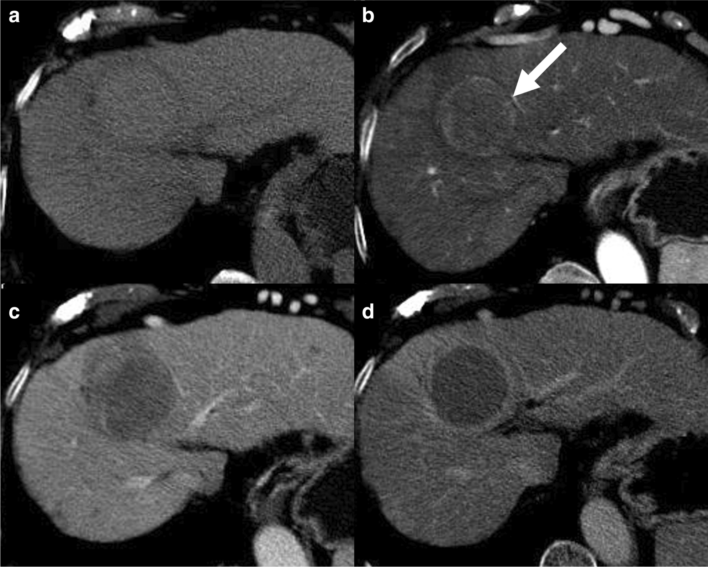{.lightbox height="500"}
:::
:::::

## Patient Selection: Staging

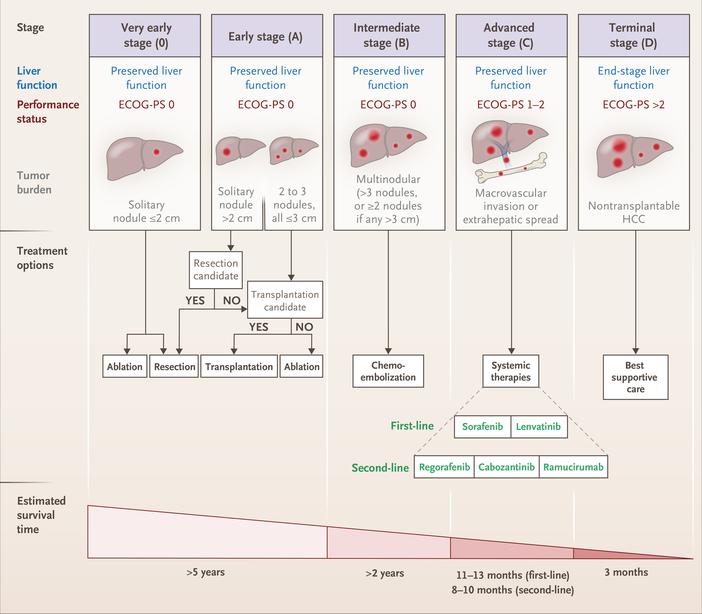{height="500" fig-align="center"}

## Mapping Angiogram

Comprehensive vascular mapping with CBCT to identify tumor supply and
prevent extrahepatic deposition.

::::: columns
::: column
-   Selective catherization

-   Identify variant hepatic arterial anatomy

-   Coil embolization of gastroduodenal or right gastric artery

-   MAA injection to estimate lung shunt and dosimetry
:::

::: column
{.lightbox}
:::
:::::

## Treatment Day

::::: columns
::: column
-   Selective catheterization

-   Deliver microspheres slowly under fluoroscopy

-   Post-treatment SPECT or PET imaging
:::

::: column
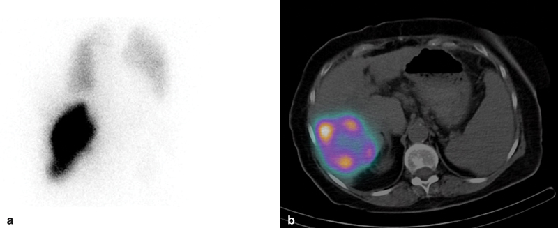{.lightbox}
:::
:::::

## Case 1

::: panel-tabset
### Profile

 brief pathognomonic HPI

 BP mmHg / HR / RR / T / SpO₂

 key physical findings

 pertinent labs

### Imaging



### Procedure



### Pearls

1.  
:::

## Case 2

::: panel-tabset
### Profile

 brief pathognomonic HPI

 BP mmHg / HR / RR / T / SpO₂

 key physical findings

 pertinent labs

### Imaging



### Procedure



### Pearls

1.  
:::

## Case 3

::: panel-tabset
### Profile

 brief pathognomonic HPI

 BP mmHg / HR / RR / T / SpO₂

 key physical findings

 pertinent labs

### Imaging



### Procedure



### Pearls

1.  
:::
