## Overview

::: incremental
-   Leimyomas

-   IR and UAE

-   Literature
:::

## Clinical Challenge

Uterine fibroids are the most common benign neoplasia of reproductive age, creating a substantial burden for millions of women

::: {.columns}
::: {.column}

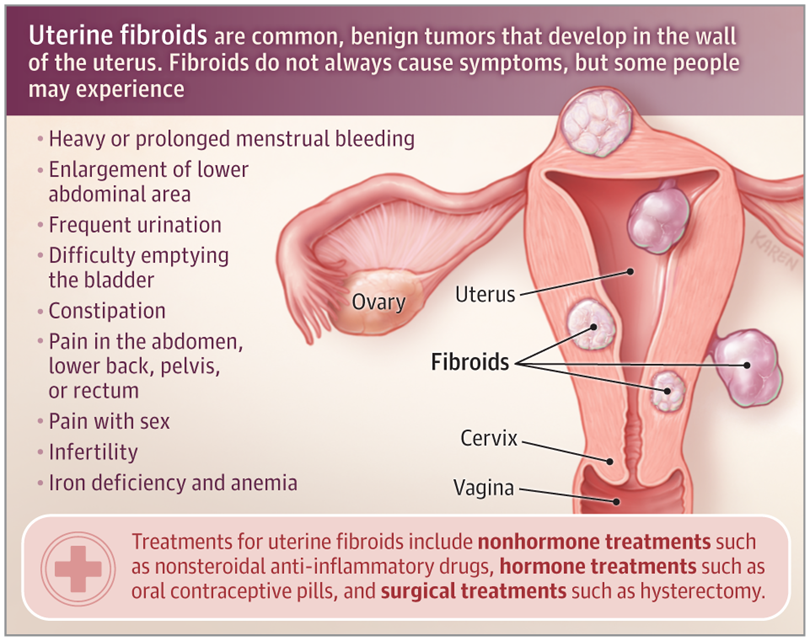{.lightbox}

:::
::: {.column}
- Affects up to 60-70% of all women by age 50.

- Over 80% of African American women are diagnosed by the age of 50.

- African American women experience an earlier onset, higher cumulative risk, larger and more numerous fibroids, and more severe symptoms.

- African American women are 2-3 times more likely to undergo a hysterectomy and 6.8 times more likely to undergo a myomectomy
:::
:::

## Treatment Gap Between Patient Preferences and Clinical Reality

Despite a preference for non-surgical and uterine-sparing treatments, particularly among Black women, hysterectomy remains a dominant therapy.

::: {.columns}
::: {.column}
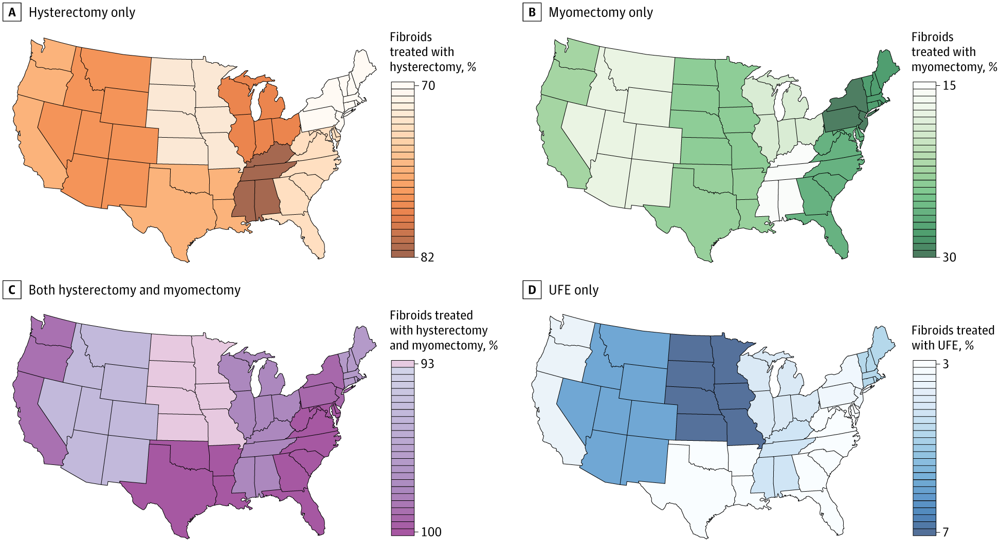{.lightbox}
:::
::: {.column}
- Hysterectomy is the only definitive, but most invasive treatment and results in infertility. Myomectomy preserves the uterus but involves myometrial traua and adhesions.

- Women with lower socioeconomic status are more likely to receive invasive treatments. This may be due to delaying care until symptoms are severe, limiting less invasive options.
:::
:::

## Treatment Gap Between Patient Preferences and Clinical Reality

Despite a preference for non-surgical and uterine-sparing treatments, particularly among Black women, hysterectomy remains a dominant therapy.

::: {.columns}
::: {.column}
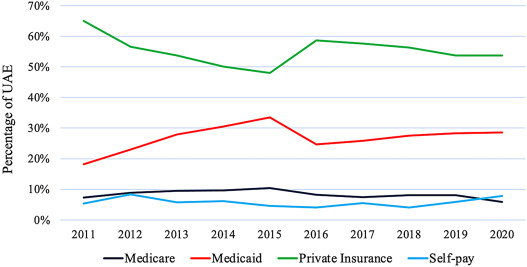{.lightbox}
:::
::: {.column}
- Hysterectomy is the only definitive, but most invasive treatment and results in infertility. Myomectomy preserves the uterus but involves myometrial traua and adhesions.

- Women with lower socioeconomic status are more likely to receive invasive treatments. This may be due to delaying care until symptoms are severe, limiting less invasive options.
:::
:::

## Enter Interventional Radiology

- Modern IR began on January 16, 1964, when Dr. Charles T. Dotter performed the first transluminal angioplasty.

- Uterine artery embolization is introduced in the 1970s as a life-saving procedure to control intractable postpartum hemorrhage as an alternative to emergency hysterectomy

- In a landmark 1995 paper in The Lancet, French gynecologist Dr. J.H. Ravina and his IR colleagues proposed that if embolization could safely control acute hemorrhage, it could probably also be used to cut off blood supply to hypervascular fibroids.

**Key findings from 16 patients:**

- 20-80% reduction in volume in 12 patients

- 6-12 hours of post-embolization pain in 14 patients 

# A Glimpse into the Angio Suite

## Uterine fibroid types {auto-animate="true" auto-animate-easing="ease-in-out"}

::::: columns
::: {.column width="40%"}
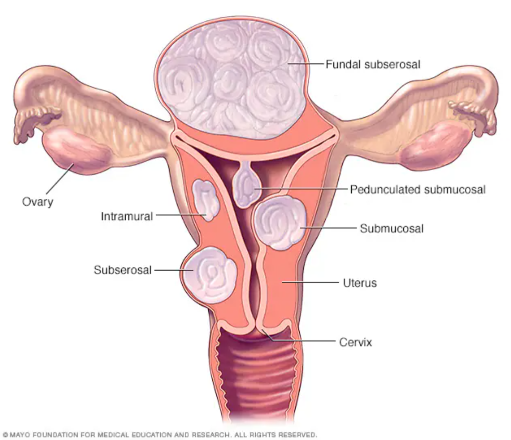{alt="https://www.mayoclinic.org/diseases-conditions/uterine-fibroids/symptoms-causes/"}
:::

::: {.column width="60%"}
#### FIGO Classification System

##### Other Group

-   Type 0: pedunculated intracavitary

-   Type 1: \<50% intramural

-   Type 2: ≥50% intramural

-   Type 3: 100% intramural; contacts endometrium

-   Type 4: intramural

-   Type 5: subserosal ≥50% intramural

-   Type 6: subserosal \<50% intramural

-   Type 7: subserosal pedunculated

-   Type 8: other, e.g. cervical, parasitic
:::
:::::

## Ultrasound {background-color="black" auto-animate="true" auto-animate-easing="ease-in-out"}

:::::: columns
::: {.column width="30%"}
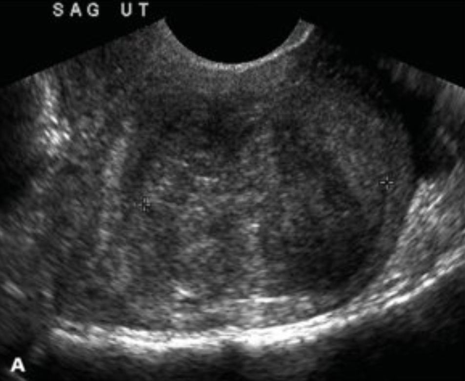{.lightbox}
:::

::: {.column width="30%"}
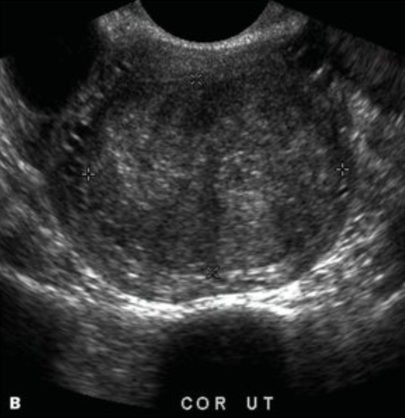{.lightbox}
:::

::: {.column width="30%"}
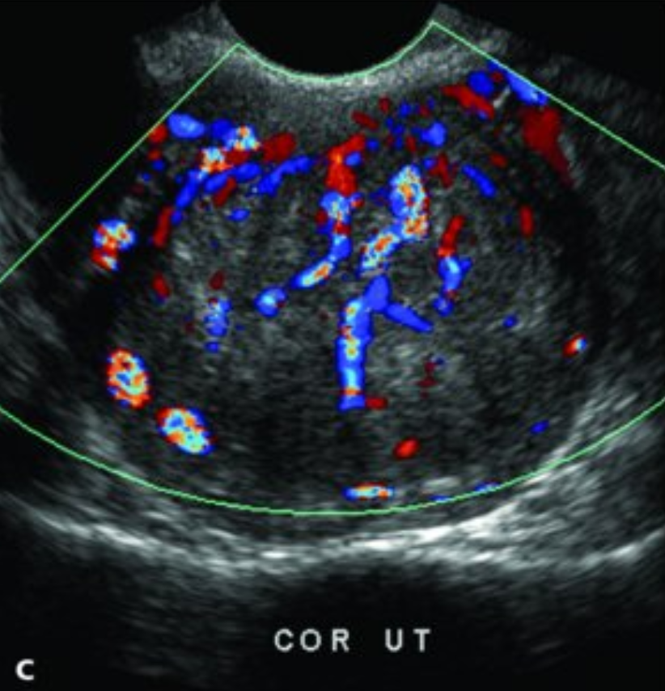{.lightbox}
:::
::::::

::: aside
Doubilet PM, et al. Atlas of Ultrasound in Obstetrics and Gynecology: A Multimedia Reference, 3e.
:::

## MRI {background-color="black" auto-animate="true" auto-animate-easing="ease-in-out"}

::::: columns
::: {.column width="40%"}
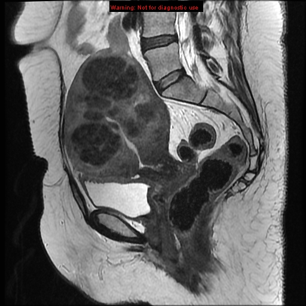{.lightbox}
:::

::: {.column width="40%"}
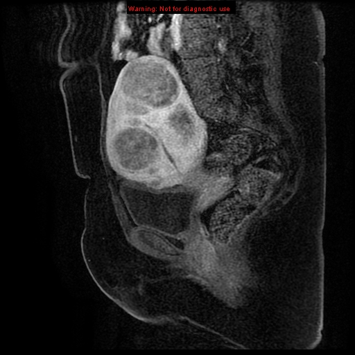{.lightbox}
:::
:::::

::: aside
Case courtesy of Hani M. Al Salam, Radiopaedia.org, rID: 12507
:::

::: aside
https://www.mayoclinic.org/diseases-conditions/uterine-fibroids/symptoms-causes/
:::

## Pre-Op Requirements

::: {.columns}
::: {.column}
**Absolute contraindications:**

- viable pregnancy

- active untreated infection

- suspected gynecological malignancy

**Relative contraindications:**

- coagulopathy

- severe contrast allergy

- severe renal impairement
:::
::: {.column .incremental}
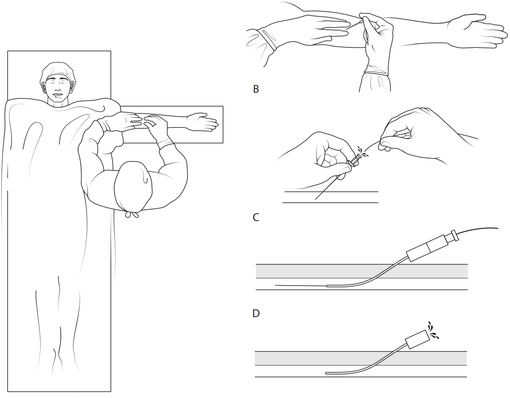{.lightbox}
:::
:::

## Procedure

::: {.columns}
::: {.column}
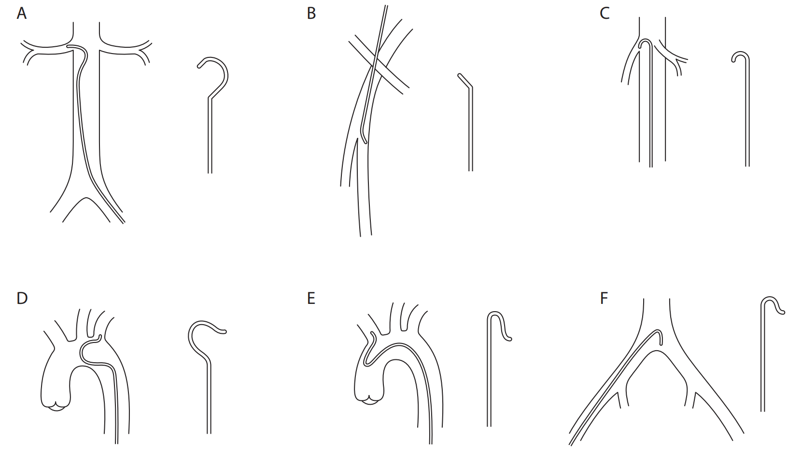{.lightbox}
:::
::: {.column}
Vascular access: 

- Common femoral artery (traditional)

- Radial artery (newer)

Path

- Aorta -> Common Iliac -> Internal Iliac -> Anterior Division -> Uterine Artery

:::
:::

## Procedure

::: {.columns}
::: {.column}
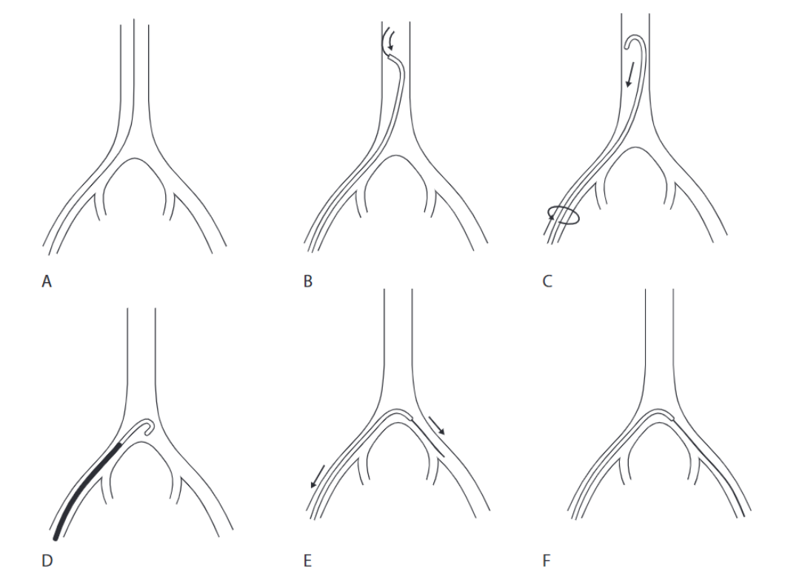{.lightbox}
:::
::: {.column}
Vascular access: 

- Common femoral artery (traditional)

- Radial artery (newer)

Path

- Aorta -> Common Iliac -> Internal Iliac -> Anterior Division -> Uterine Artery

:::
:::

## Post-Op Management

::: {.columns}
::: {.column}
0-24 Hours: Post-Embolization syndrome

- Ischemic necrosis releases inflammatory cytokines

- symptoms: severe cramping, nausea, low-grade fever

- *Expected physiological response, not a complication
:::
::: {.column}
Pain Protocol:

- PCA Pump: Morphine/Dilaudid for 12-24h

- NSAIDs: Ketorolac IV or Ibuprofen PO

- Anti-emetics
:::
::: 

##

::: {.column}

:::

::: {.columns}
::: {.column}
Discharge Criteria:

- Pain controlled on oral meds, patient ambulating and voiding

- Expected decrease in bulk/pain and menorrhagia within 2 weeks
:::
::: {.column}
DC and Follow-up

- US in 2 weeks to assess the uterine size
:::
:::
## Complications

::: {.r-stack}
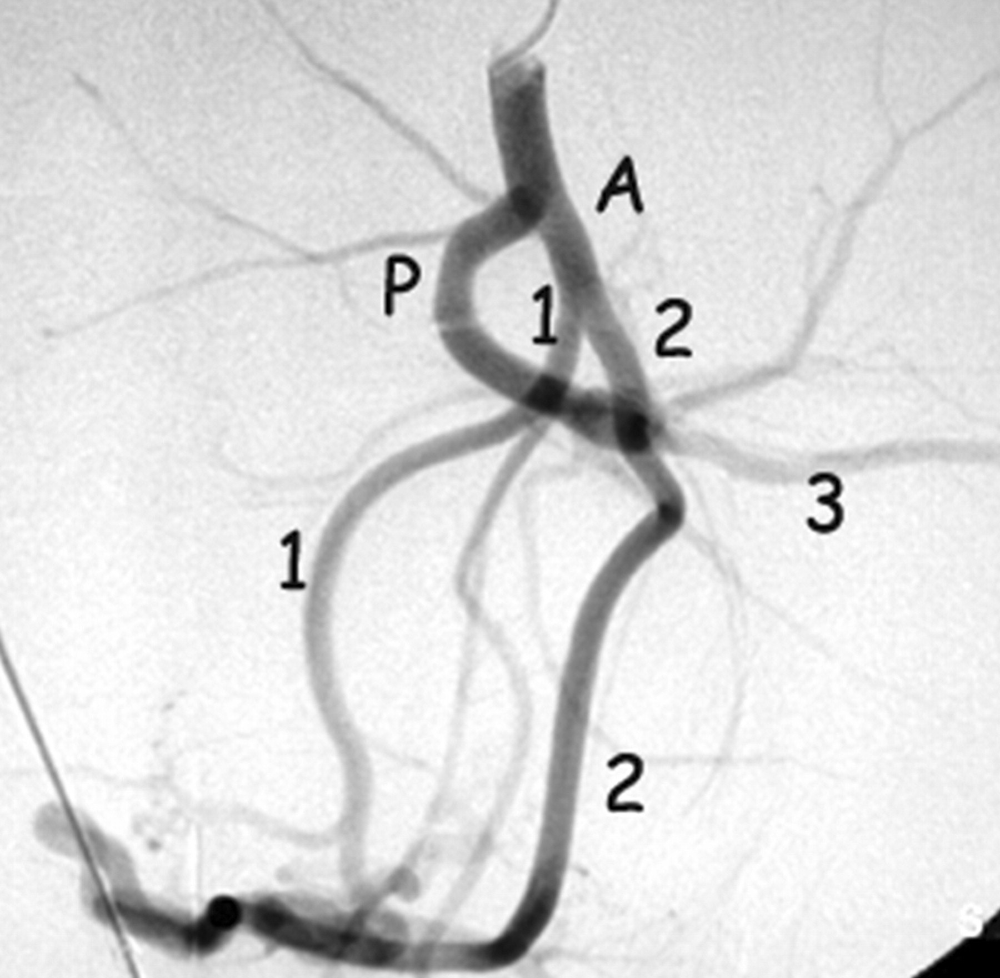{.fragment .lightbox width="450"}

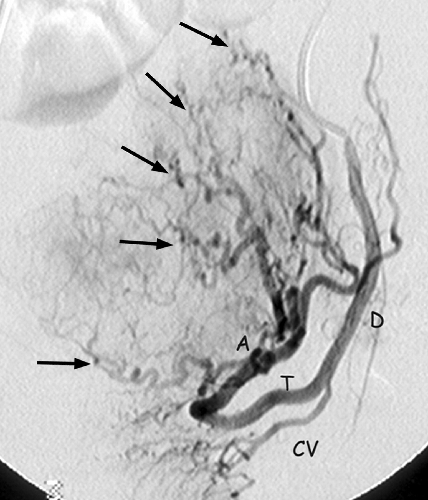{.fragment .lightbox width="450"}

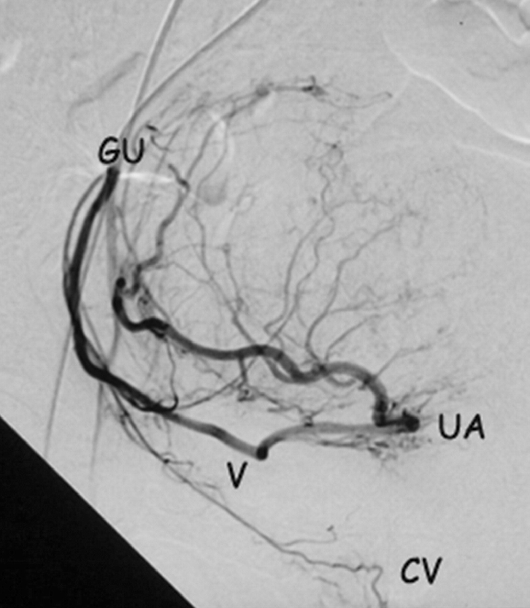{.fragment .lightbox width="450"}

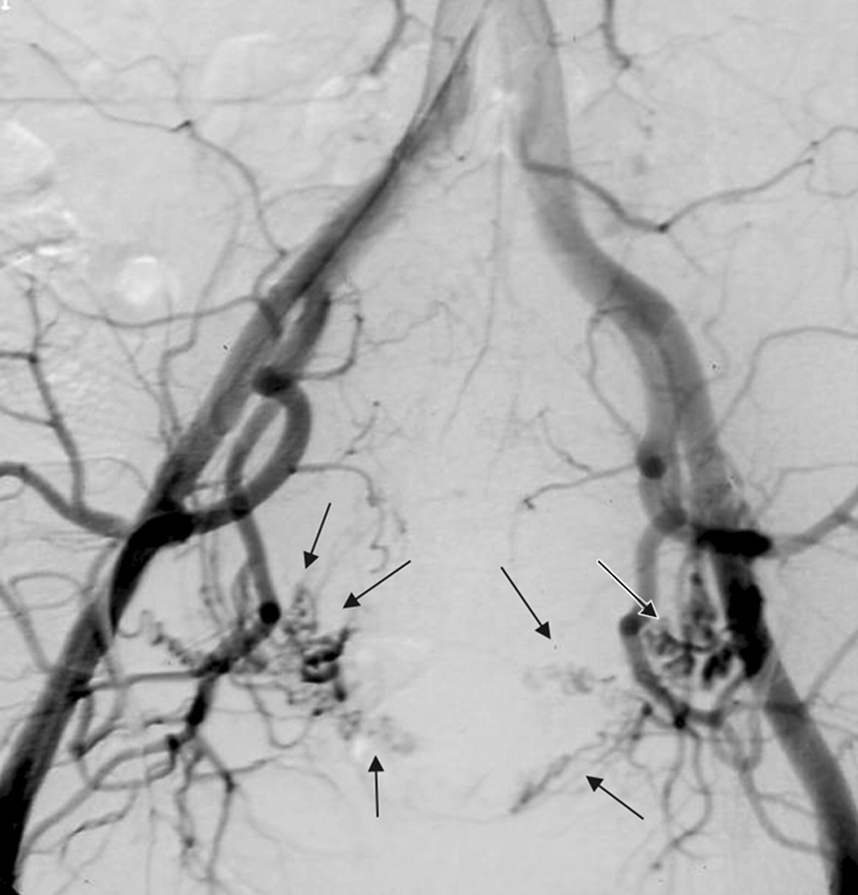{.fragment .lightbox width="450"}
:::

- Utero-ovarian anastomosis: 1-5% risk of premature ovarian failure

- Gluteal artery: risk of skin necrosis

- Vaginal artery: risk of necrosis

## Case {background-video="images/access.mp4 "background-video-loop="true" background-size="cover"}

## Case {background-video="images/aorta.mp4 "background-video-loop="true" background-size="cover"}

## Case {background-video="images/iliac.mp4 "background-video-loop="true" background-size="cover"}

## Case {background-video="images/selective.mp4 "background-video-loop="true" background-size="cover"}

## Case {background-video="images/delivery.mp4 "background-video-loop="true" background-size="cover"}

## Case {background-video="images/occlusion.mp4 "background-video-loop="true" background-size="cover"}

# Evolution of the Procedure

## Research
Over the past two decades, UAE has been rigorously evaluated in numerous randomized control trials. It is has now advanced to Stage 4 (Long-Term Follow-Up) of the IDEAL framework. We now have a robust evidence base to understand its role in modern fibroid care.

## Quality of Life and Symptom Control

Multiple meta-analyses of RCTs have compared patient-reported outcomes between UAE and myomectomy.

- Quality of Life: Both procedures lead to substantial improvements in health-related quality of life, with little to no significant difference between the two at 2- and 4-year follow-up.

- Symptom severity: While both are effective, myomectomy shows a statistically significant advantage in improving symptom severity scores at 2- and 4-years post-procedure.

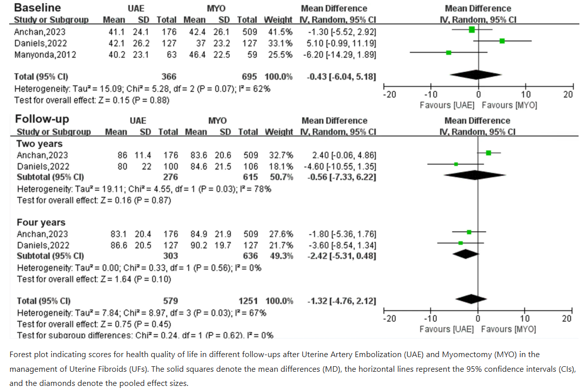

::: aside
Tzanis et al. 2024, de Smit et al. 2025, Peng et al. 2024
:::

## Durability

- Meta-analyses consistently show that myomectomy is associated with significantly lower risk of reintervention compared to UAE. (RR 0.32 favoring myomectomy).

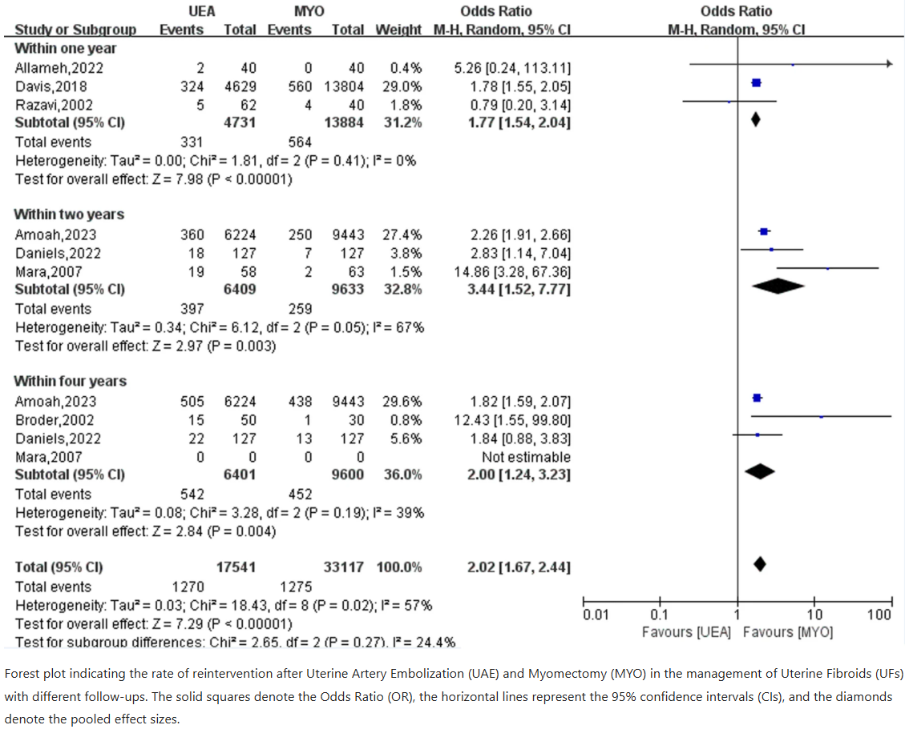

The long-term rate of subsequent hysterectomy is also higher in the UAE group.

::: aside
Tzanis et al. 2024, de Smit et al. 2025, Peng et al. 2024
:::

## Patient Safety and Recovery

The minimally invasive nature of UAE translates into a different periprocedural safety and recovery profile compared to surgery.

- Complication rate: UAE is associated with a lower rate of early complications (OR 0.44)

- Hospital stay: UAE results in significantly shorter length of hospital stay

- Readmission rates: Uae results in lower readmission rates

## Fertility

The effect of UAE on future fertility is one of the most debated aspects of the procedure. While successful pregnancies are well-documented post-UAE, significant  uncertanties remain.

::: {.columns}
::: {.column}
**Current Consensus**

- Standard of Care: Myomectomy remains the leading recommended treatment for women with fibroids who wish to conceive (ACOG, CNGOF).

- Pregnancy rates: Meta-analyses show either a decreased postoperative pregnancy rate after UAE or no statistically significant difference compared to myomectomy.

- Obstetric risk: Several studies report an incresed risk of miscarriage, placental abnormalities (previa, accreta), and postpartum hemorrhage following UAE. A 2008 RCT noted a micarriage rate of 64% in UAE groups, though the trial had limitations.
:::
::: {.column}
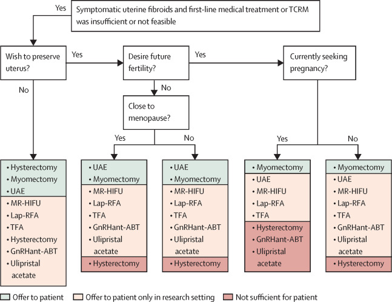
:::
:::

## Sources {.scrollable}

1. Reid D, Noel B, Lam J, Renteria J, McCrackin S, Quinn G. Racial Disparities in Surgical Outcomes for Uterine Fibroids: A Systematic Review. Arch Obstet Gynecol. 2025;6(1):1–10. 

2. Patetta MA, Griffith KN, Walker JA, Kohi MP, Keefe NA, Salazar G. A Decade Long Analysis of Healthcare Disparities and Uterine Artery Embolization: An Exploration of Social Determinants of Health. Journal of Vascular and Interventional Radiology. 2025 Mar;36(3):521-528.e4. 

3. Mitro SD, Dyer W, Lee C, Bindra A, Wang L, Ritterman Weintraub M, et al. Uterine Fibroid Diagnosis by Race and Ethnicity in an Integrated Health Care System. JAMA Netw Open. 2025 Apr 2;8(4):e255235. 

4. Fabre C, Boeken T, Simon V, Dean C, Sapoval M, Pellerin O, et al. Fertility outcomes after uterine artery embolization for symptomatic leiomyomas. CVIR Endovasc. 2025 Oct 16;8(1):83. 

5. Elhakim TS, Smolinski-Zhao S, Miyasato D, Lee V, Mansur A, Puello M, et al. Disparities in Utilization of Uterine Fibroid Embolization. JAMA Netw Open. 2025 Sep 16;8(9):e2532100. 

6. De Smit NS, De Lange ME, Boomsma MF, Huirne JAF, Hehenkamp WJK. Current treatment for symptomatic uterine fibroids: available evidence and therapeutic dilemmas. The Lancet. 2025 Jul;406(10498):91–102. 

7. Tzanis AA, Antoniou SA, Gkegkes ID, Iavazzo C. Uterine artery embolization vs myomectomy for the management of women with uterine leiomyomas: a systematic review and meta-analysis. American Journal of Obstetrics and Gynecology. 2024 Aug;231(2):187-195.e1. 

8. Peng J, Wang J, Shu Q, Luo Y, Wang S, Liu Z. Systematic review and meta-analysis of current evidence in uterine artery embolization vs myomectomy for symptomatic uterine fibroids. Sci Rep. 2024 Aug 20;14(1):19252. 

9. Laily A, Nair I, Shank SE, Wettschurack C, Khamis G, Dykstra C, et al. Enhancing Uterine Fibroid Care: Clinician Perspectives on Diagnosis, Disparities, and Strategies for Improving Health Care. Women’s Health Reports. 2024 Mar 1;5(1):293–304. 

10. Keefe NA, Haskal ZJ. Uterine Artery Embolization. In: Keefe NA, Haskal ZJJ, Park AW, Angle JF, editors. IR Playbook [Internet]. Cham: Springer International Publishing; 2024 [cited 2026 Jan 15]. p. 381–92. Available from: https://link.springer.com/10.1007/978-3-031-52546-9_31

11. Evans J, Jones K. The role of socioeconomic status in uterine fibroid awareness and treatment: a narrative review. Clin Med�Insights�Reprod�Health. 2024 Jan;18:26334941241297634. 

12. Yan X, Zhou L, He G, Liu X. Pregnancy rate and outcomes after uterine artery embolization for women: a systematic review and meta-analysis with trial sequential analysis. Front Med. 2023 Dec 21;10:1283279. 

13. Ravina JH, Ciraru-Vigneron N, Bouret JM, Herbreteau D, Houdart E, Aymard A, et al. Arterial embolisation to treat uterine myomata. The Lancet. 1995 Sep;346(8976):671–2. 
