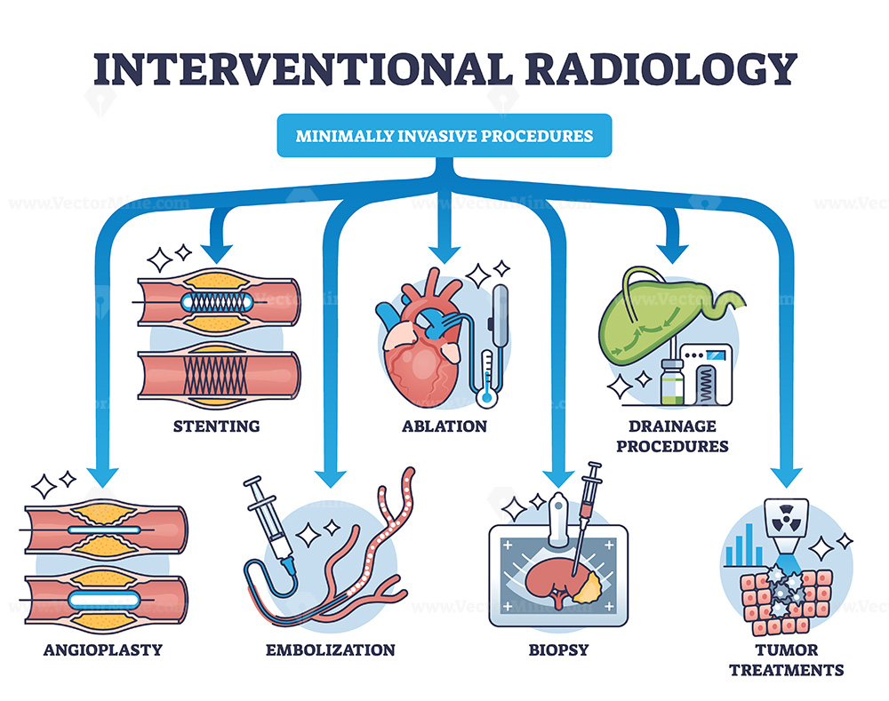

## Welcome to the IR Chalk Talk

Every needle stick, catheter, or wire can cause bleeding.

We need to balance thrombotic risk (why patient is anticoagulated) vs bleeding risk (from procedure)

## Pre-Procedure Coagulation Labs: The Basics

Essential labs for most IR procedures (within 30 days unless acute change):

- **INR**: assesses warfarin effect; target <1.5 for high-risk procedures

- **Platelet count**: target >50k for high-risk procedures; >20k may be acceptable for low-risk

- **aPTT**: for heparin monitoring; target <1.5x control for high-risk procedures

- **Fibrinogen**: especially in cirrhosis; target >100 mg/dL for high-risk procedures

- **Creatinine**: for DOAC dosing and clearance; affects hold times

## Common Anticoagulants: Warfarin

*coumadin*

**Mechanism**: inhibits vitamin K–dependent factors (II, VII, IX, X, proteins C and S)

**Half‑life**: 36-40 hours 

**Reversal**: Vitamin K (oral/IV), FFP, PCC (4‑factor) 

## Common Anticoagulants: DOACs

*apixaban, rivaroxaban, edoxaban, dabigatran*

**Mechanism**: Direct factor Xa or IIa inhibitors

**Half‑life**: 5‑15 hours (renal dependent) 

**Reversal**: Andexanet alfa (Xa), idarucizumab (dabigatran), or PCC 25-50 U/kg off‑label 

**Note**: DOACs have shorter half-lives than warfarin, but renal impairment can prolong clearance

## Antiplatelet Agents: Aspirin and P2Y12 Inhibitors

*aspirin*

**Mechanism**: Irreversible COX inhibitor, inhibits platelet aggregation

**Half-life**: 7-10 days (platelet lifespan)

**Reversal**: Platelet transfusion may be considered, but evidence is limited and may not be effective

## Antiplatelet Agents:  P2Y12 Inhibitors

*clopidogrel, prasugrel, ticagrelor*

**Mechanism**: Inhibit ADP-mediated platelet activation

**Half-life**: clopidogrel/prasugrel 7-10 days, ticagrelor 3-5 days

**Reversal**: Platelet transfusion may be considered, but evidence is limited and may not be effective

## Risk Stratification for IR Procedures

Low Bleeding Risk: e.g., paracentesis, thoracentesis, superficial biopsies

- usually continue aspirin, INR <3.0, platelets >20k

High Bleeding Risk: e.g., liver biopsy, nephrostomy, arterial interventions

- hold aspirin 5-7 days, INR <1.5, platelets >50k

## Case 1: Paracentesis in a Cirrhotic Patient

**Scenario**: 65-year-old with cirrhosis, tense ascites, INR 1.8, platelets 70. On no acticoagulants.

## Case 1: Paracentesis in a Cirrhotic Patient

**Scenario**: 65-year-old with cirrhosis, tense ascites, INR 1.8, platelets 70. On no acticoagulants.

**Plan**: Proceed – paracentesis is low risk.

**Evidence**: SIR guidelines accept INR ≤ 2.5 and platelets ≥ 20k for low‑risk procedures. Recent NIH review confirms safety with mild-moderate coagulopathy.

**Take‑home**: Don't delay therapeutic taps for mild coagulopathy. Use ultrasound guidance.

## Case 2: Liver Biopsy on Warfarin

**Scenario**: 62F with hepatitis C, needs liver biopsy. On warfarin for AFib (CHADS2‑VASc 3). INR 2.8.

## Case 2: Liver Biopsy on Warfarin

**Scenario**: 62F with hepatitis C, needs liver biopsy. On warfarin for AFib (CHADS2‑VASc 3). INR 2.8.

**Plan**: 
- Hold warfarin 5 days

- Check INR <1.8 before biopsy

- No bridging needed for AFib with moderate stroke risk

**Evidence**: SIR guidelines recommend holding warfarin for high‑risk procedures. Recent studies show low thrombotic risk with short-term interruption in AFib.

**Take‑home**: For high‑risk procedures, hold warfarin and confirm INR. Bridging often not needed for AFib.

## Case 3: Nephrostomy on Apixaban

**Scenario**: 70M with obstructing stone, febrile, pyonephrosis. On apixaban for DVT (CrCl 40).

## Case 3: Nephrostomy on Apixaban

**Scenario**: 70M with obstructing stone, febrile, pyonephrosis. On apixaban for DVT.

**Plan**:
- Emergent nephrostomy needed

- Hold apixaban, but proceed with procedure

- Reversal options: Andexanet alfa (factor Xa inhibitor) or PCC if bleeding occurs

**Evidence**: SIR guidelines suggest holding DOACs for high‑risk procedures, but in emergencies, proceed with caution. Reversal agents can be considered if bleeding occurs.

**Take‑home**: In emergencies, prioritize patient stability. Hold DOACs if possible, but don't delay critical interventions. Know your reversal options.

## Correcting Coagulopathy: Agents

**Vitamin K**: for warfarin reversal, takes 6-12 hours

**FFP**: provides clotting factors, requires large volume, risk of transfusion reactions

**PCC (4‑factor)**: concentrates factors II, VII, IX, X; rapid reversal of warfarin; off-label for DOACs

**Andexanet alfa**: specific reversal for factor Xa inhibitors; costly

**Idarucizumab**: specific reversal for dabigatran; rapid onset

**Platelet transfusion**: for antiplatelet agents, but evidence is limited and may not be effective

**Cryoprecipitate**: for fibrinogen replacement in cirrhosis, but evidence is limited

**Tranexamic acid**: antifibrinolytic, may be considered in bleeding, but evidence in IR is limited

## Special Situations

**Liver Cirrhosis**: coagulopathy is complex; INR may not reflect bleeding risk; consider TEG/ROTEM if available; correction with FFP or cryoprecipitate may be considered for high-risk procedures

**Renal Impairment**: affects clearance of DOACs; may require longer hold times; consider hemodialysis for dabigatran if urgent reversal needed

**Mechanical Heart Valves**: high thrombotic risk; usually require bridging with heparin when holding warfarin; consult cardiology

**Pediatric Patients**: limited data; generally follow adult guidelines but consider age-specific factors and consult pediatric hematology + IR

## When to Bridge? (and When Not To)

**Bridging**: using short-acting anticoagulants (e.g., LMWH) during warfarin interruption to reduce thrombotic risk

**Indications for bridging**: 

- Mechanical heart valves

- Recent VTE (<3 months)

- High CHADS2‑VASc score (≥5)

**When not to bridge**:

- BRIDGE trial [^1] showed increased bleeding without significant reduction in thrombotic events for AFib patients with moderate stroke risk (CHADS2‑VASc ≤4)

::: aside
[^1]: BRIDGE Trial, NEJM 2015
:::

## Works Cited {.scrollable}

1. Taylor, Jordan et al. “Anticoagulation and Antiplatelet Agents in Peripheral Arterial Interventions.” Seminars in interventional radiology vol. 39,4 364-372. 17 Nov. 2022, doi:10.1055/s-0042-1757314

2. Patel, Rishi et al. “SIR Consensus Guidelines on Periprocedural Management of Thrombotic and Bleeding Risk in Patients Undergoing Percutaneous Image-Guided Interventions.” Journal of vascular and interventional radiology : JVIR vol. 30,9 (2019): 1432-1448.e19. doi:10.1016/j.jvir.2019.05.026

3. Padua, Horacio et al. “Appendix to the Society of Interventional Radiology Consensus Guidelines for the Periprocedural Management of Thrombotic and Bleeding Risk in Patients Undergoing Percutaneous Image-Guided Interventions: Pediatric Considerations.” Journal of vascular and interventional radiology : JVIR vol. 33,11 (2022): 1424-1431. doi:10.1016/j.jvir.2022.07.006

4. Douketis, James D et al. “Perioperative Bridging Anticoagulation in Patients with Atrial Fibrillation.” The New England journal of medicine vol. 373,9 (2015): 823-33. doi:10.1056/NEJMoa1501035